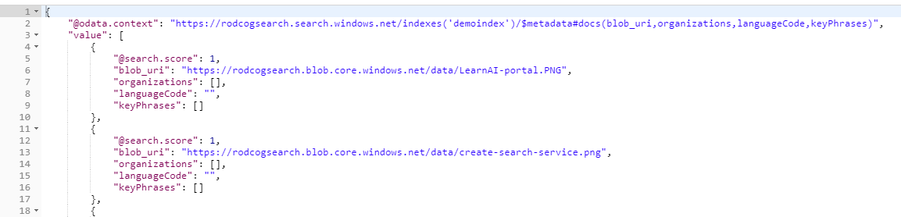

# Capstone Project: Lab4-Image-Skills.
In this lab, you will verify the lack of image processing results we got from the previous lab and fix it by adding image analysis skill set to our pipeline.

## Part I: The Problem Statement

There are png and jpg images within the provided dataset. If you decided to bring your own data, it was suggested to also include images. But we did not add any predefined skillsets for image analysis. This is exactly what you will do now, but first, let's check out the kind of problems we could expect to see if we used the Language Detection, Text Split, Named Entity Recognition and Key Phrase Extraction Skills on images with steps 1 and 2.

### Step 1 - Checking warning message from the API

Let's check the indexer status again, it has valuable information about our "images problem". You can use the same command we used in the previous lab (pasted below for convenience). If you used another indexer name, just change it in the URL.

```http
GET https://[your-service-name].search.windows.net/indexers/demoindexer/status?api-version=2019-05-06
Content-Type: application/json
api-key: [api-key]
```

If you check the response messages for any of the png or jpg files in the results, there will be warnings about missing text for the images.

### Step 2 - Existing skills will show no results

Let's again repeat a previous lab request, but with another analysis. you will re-execute the step to verify content.  

```http
GET https://[your-service-name].search.windows.net/indexes/demoindex/docs?search=*&$select=blob_uri,organizations,languageCode,keyPhrases&api-version=2019-05-06
api-key: [api-key]
```

Send the request and go to any result set about an image file like jpg or png, like these images listed in the image below. Note that no organizations, languageCode and keyPhrases are returned for the images, jpg or png files. That's because they were not created.



>Tip: if any image is in the top results: There is a magnifying glass button in the top right of the results screen. Click on this button to open the Search box, in the text box type **jpg** or **png** and click on the find next button to find this result.

## PART II: How to fix it

This next steps is where you work through a challenge and don't worry if you get stuck (that's why it's a challenge!), we will tips and hints as you work through this.

### Step 3 - Learning the OCR image skill
**Hint**
Two of the nine [predefined skills](https://docs.microsoft.com/en-us/azure/search/cognitive-search-predefined-skills) are related to image analysis. Your first assignment is to read about how to use them using this [link](https://docs.microsoft.com/en-us/azure/search/cognitive-search-concept-image-scenarios).

You will add OCR to the cognitive search pipeline, this skill set will read text from the images within our dataset. Here is a [link](https://docs.microsoft.com/en-us/azure/search/cognitive-search-skill-ocr) where you can read more details.

>**Note** For now, Cognitive Search uses [OCR V2](https://westus.dev.cognitive.microsoft.com/docs/services/5adf991815e1060e6355ad44/operations/587f2c6a154055056008f200) (preview), for english. And uses V1 for other languages. This may change in the future.

Image skills, like OCR and Image Analysis, are heavier than text skills. Behind the scenes, Microsoft is running deep learning algorithms on your data. Expect to have the indexer running longer than the text only skillset.

>**Note** Currently OCR only works with "/document/normalized_images" field, produced by the Azure Blob indexer when imageAction is set to generateNormalizedImages. As part of document cracking, there are a new set of indexer configuration parameters for handling image files or images embedded in files. These parameters are used to normalize images for further downstream processing. Normalizing images makes them more uniform. Large images are resized to a maximum height and width to make them consumable. For images providing metadata on orientation, image rotation is adjusted for vertical loading. Metadata adjustments are captured in a complex type created for each image.

### Step 3.1 - Review how the Enrichment Pipeline Works

Click [here](../resources/md-files/enrichment-pipeline-details.md) and review how the Enrichment Pipeline works. This content will help you with the challenge below. At the end of the page there is a link to return to this lab.

### Step 4 - Cleaning the environment

You need to prepare the environment to add the image analysis you will create. The most practical approach is to delete the objects from Azure Search and rebuild them. This also avoids redundancy of similar information. This cleaning also reduces cost, two replicated/similar indexes will use space os the service. Last, but not least: it is also important to learn about DELETES which is also an objective of this hackathon. 

 Save all the scripts (API calls) you've done up until this point, including the definition json files you used in the "body" field.
 Let's start deleting the index and the indexer. You can use Azure Portal or API calls:

1. [Deleting the indexer](https://docs.microsoft.com/en-us/rest/api/searchservice/delete-indexer)
2. [Deleting the index](https://docs.microsoft.com/en-us/rest/api/searchservice/delete-index)
3. [Deleting the Skillset](https://docs.microsoft.com/en-us/rest/api/searchservice/delete-skillset)

Status code 204 is returned on a successful deletion. The deletion order doesn't matter, while when creating those objects, the indexer must be the last one, since it has references to the others.

>**Hint :** It is also possible to update the index instead of delete and recreate it. The addition of a new field is one of the situations where you can use this method.
Click [here](https://docs.microsoft.com/en-us/rest/api/searchservice/update-index) to learn more about it.

### Step 5 - Recreating the environment - Challenge

In this challenge, you will perform the following steps:

1. Recreate the Skillset
2. Recreate the Index
3. Recreate the Indexer
4. Check Indexer Status - If you don't have a different result, something went wrong.
5. Check the Index Fields - Check the image fields you just created.
6. Check the data - If you don't have a different result, something went wrong.

#### Step 5.1 Creating the skillset for images

Use the same skillset definition from the previous lab,  adding the [OCR image analysis skill](https://docs.microsoft.com/en-us/azure/search/cognitive-search-skill-ocr) to your skillset. The objectives are:

1. Save the text extracted from OCR into the index

2. Submit the text extracted from OCR and also the `content`, extracted by default from all text documents, to language detection, key phrases, and entity detection. You will need to use another pre-defined skill to merge the text, since you can't use the same skill twice in the same skillset. It is part of the challenge to find the correct skill and how to use it

#### Step 5.2 - Recreating the index and indexer

Skipping the services and the data source creation, repeat the other steps of the previous lab, in the same order. Use the same scripts as a reference.

**Hint 1:** What you need to do:

1. Create a new index exactly like the one we did in the previous lab, but with an extra field for the OCR text from the images. Name the new field as **myOcrText**. You can use the same json body field and add the new OCR field in the end. If you decide to use a different name, you will need to change the Bot code to make it work.

2. Create a new indexer exactly like the one we did in the previous, but with and extra mapping for the new skill and the new field listed above. You can use the same json body field and add the new OCR mapping in the end

3. Check the indexer execution status as you did in the previous lab

**Hint 2:** Your new field in the Index must have the [Collection Data Type](https://docs.microsoft.com/en-us/rest/api/searchservice/Supported-data-types?redirectedfrom=MSDN).

**Hint 3:** Your indexer sourceFieldName for the OCR text field has to be /document/normalized_images/*/myOcrText if your field is named myOcrText.

**Hint 4:** Now your skillset has image skills. The indexer processing time will be bigger than what you saw in the last lab, up to 10 minutes is expected.

#### Step 5.3 - Validation

Run the same query of the Step 2, the URL is pasted below. Now you should see organizations, languageCode and keyPhrases for most of the images.

```http
GET https://[your-service-name].search.windows.net/indexes/demoindex/docs?search=*&$select=blob_uri,organizations,languageCode,keyPhrases&api-version=2019-05-06
Content-Type: application/json
api-key: [api-key]
```

Now run the query below to check the OCR text extracted from the images. You Should see text for most of the images.

```http
GET https://[your-service-name].search.windows.net/indexes/demoindex/docs?search=*&$select=blob_uri,myOcrText&api-version=2019-05-06
Content-Type: application/json
api-key: [api-key]
```

#### Success Criteria 
Step 5.4 - Portal
To complete this challenge successfully, you must perform the following search and return the expected result:

**Hint :**
Log into the Azure portal and verify the creation of the skillset, index and indexers in the Azure Search dashboard. If nothing is missed, use the Search Explorer to do the searches below. Click on the files URLs (crtrl+click) to check if the AI services created the metadada as expected.

+ Search for "linux"

```http
search=myOcrText:linux&querytype=full
```

+ Search for "microsoft"

```http
search=myOcrText:microsoft&querytype=full
```

+ Search for "Learning", what will show you an image of the LearnAI Team portal, who created this training.

```http
search=myOcrText:Learning&querytype=full
```

## Resources 
* [The Image Analysis Cognitive Skill](https://docs.microsoft.com/en-us/azure/search/cognitive-search-skill-image-analysis)
* [The OCR Cognitive Skill](https://docs.microsoft.com/en-us/azure/search/cognitive-search-skill-ocr)
* [The Text Merge Cognitive Skill](https://docs.microsoft.com/en-us/azure/search/cognitive-search-skill-textmerger)
* [Skillset Operations - Azure Search Service REST API](https://docs.microsoft.com/en-us/rest/api/searchservice/skillset-operations)


## To Explore Further on your own
To infer additional information from images such as generate caption from an image, generate tags, or identify celebrities(including faces), image type, color, adult content and landmarks(categories) you can use [Image Analysis Skill](https://docs.microsoft.com/en-us/azure/search/cognitive-search-skill-image-analysis) which leverages machine learning models provided by [Computer Vision](https://docs.microsoft.com/azure/cognitive-services/computer-vision/home) in Cognitive Services.

## Next Step

[Custom Skills Lab](../labs/lab5-custom-skills.md) or [Back to Read Me](../README.md)
  